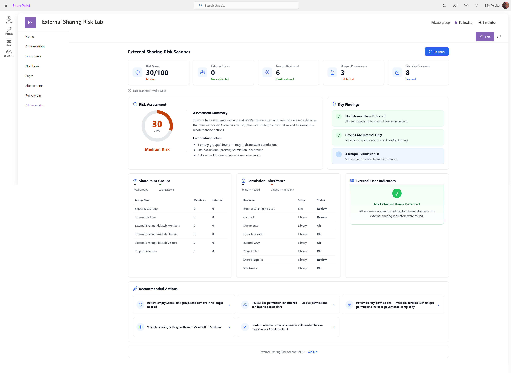

# SPFx External Sharing Risk Scanner


An open-source SharePoint Framework web part for reviewing external sharing, SharePoint group membership, permission inheritance, and governance risk indicators in SharePoint Online.

This project is designed to help SharePoint site owners, Microsoft 365 admins, consultants, and developers quickly surface common permission and external sharing risks directly from a SharePoint site.

> Need a more advanced version or help adapting this for your tenant?
> Contact me: https://www.billyperalta.com/contact

---

## Screenshot



---

## Current MVP Status

The public MVP is working and includes the initial dashboard experience for site-level permission and sharing review.

Current focus:

- Improving scan accuracy
- Improving external user detection configuration
- Expanding permission inheritance checks
- Improving documentation and test scenarios
- Preparing better demo screenshots and usage examples

---

## Overview

External sharing is useful in SharePoint Online, but it can become difficult to review as sites, libraries, folders, files, guests, and sharing links grow over time.

Many organizations do not struggle because external sharing exists. They struggle because it becomes hard to answer practical governance questions such as:

- Are there external users with access to this site?
- Are SharePoint groups empty or outdated?
- Are document libraries using unique permissions?
- Are permissions inherited or broken?
- Does this site need a governance review before migration, Copilot rollout, or broader content modernization?

The SPFx External Sharing Risk Scanner provides a lightweight dashboard that helps start those conversations.

---

## Key Features

The public MVP includes:

- SharePoint site-level risk summary
- Visual risk score indicator
- Scan summary cards
- SharePoint group review
- Possible external user indicators
- Document library inheritance review
- Unique permission indicators
- Recommended governance actions
- Read-only dashboard experience
- Microsoft 365-friendly UI
- Contact CTA for advanced/private version or customization

---

## What the Scanner Reviews

The public MVP focuses on practical site-level governance signals.

### Site Summary

Displays basic information about the current SharePoint site, including the scan context and last scanned date/time.

### SharePoint Groups

Reviews SharePoint groups associated with the site and highlights group membership indicators, including possible external users based on configured detection rules.

### Permission Inheritance

Reviews document libraries and identifies whether inheritance appears to be inherited or broken.

### Unique Permissions

Highlights libraries that may require additional review because unique permissions can increase governance complexity and access drift.

### Recommended Actions

Provides practical next steps based on scan findings, such as reviewing empty SharePoint groups, checking libraries with unique permissions, and validating sharing settings with Microsoft 365 admins.

### Copilot Readiness

Helps organizations preparing for Microsoft 365 Copilot understand whether unclear permissions or oversharing may create content exposure concerns.

---

## Why This Matters

SharePoint permission issues often become visible too late — during an audit, migration, support ticket, security review, or Copilot readiness assessment.

This project helps demonstrate why organizations should regularly review:

- External sharing
- SharePoint group membership
- Broken permission inheritance
- Unique permissions
- Empty or outdated groups
- Governance and ownership gaps

The goal is not to replace enterprise security tools. The goal is to provide a simple, practical starting point that makes permission and sharing conversations easier for site owners and administrators.

---

## Intended Audience

This project may be useful for:

- SharePoint developers
- SharePoint administrators
- Microsoft 365 consultants
- Intranet owners
- Site collection administrators
- Governance teams
- Migration teams
- Security and compliance stakeholders
- Technical recruiters or hiring managers reviewing SharePoint/SPFx work

---

## Example Use Cases

### External Sharing Review

A site owner wants to understand whether external users may have access to a SharePoint site and whether the current sharing state should be reviewed.

### Governance Review

A Microsoft 365 admin wants a lightweight way to show why permissions and external sharing should be part of a broader governance process.

### Migration Readiness

A migration team wants to identify sites that may need permission cleanup before content is moved, archived, or modernized.

### Copilot Readiness

An organization preparing for Microsoft 365 Copilot wants to understand whether unclear permissions or oversharing may create content exposure concerns.

### Portfolio / Technical Demonstration

This project demonstrates practical SharePoint Framework development, Microsoft 365 governance thinking, React-based UI design, and real-world SharePoint permission scenarios.

---

## Technical Stack

This project is built with:

- SharePoint Framework
- React
- TypeScript
- Microsoft Graph, where appropriate
- SharePoint REST APIs, where appropriate
- PnPjs, where useful
- Fluent UI / Microsoft 365-friendly design patterns
- SCSS module-based styling

The web part is designed to be read-only and focused on visibility, review, and guidance.

---

## Recommended Environment

Use the latest supported SharePoint Framework toolchain for new development.

Recommended baseline:

- SPFx 1.22.x or latest stable SPFx version
- Node.js v22 LTS for SPFx 1.22.x
- React version supported by the selected SPFx version
- TypeScript version supported by the selected SPFx version
- SharePoint Online workbench or hosted workbench for testing

Always confirm the exact Node.js, React, and TypeScript compatibility from the official SPFx compatibility matrix before upgrading the project.

---

## Local Development

Clone the repository:

```bash
git clone https://github.com/BillySharePoint/spfx-external-sharing-risk-scanner.git
cd spfx-external-sharing-risk-scanner
```

Install dependencies:

```bash
npm install
```

Run the local development server:

```bash
gulp serve
```

---

## Deployment

To deploy the web part to SharePoint Online:

1. Run a production bundle:

```bash
gulp bundle --ship
```

2. Package the solution:

```bash
gulp package-solution --ship
```

3. Locate the generated `.sppkg` file in:

```txt
sharepoint/solution
```

4. Upload the `.sppkg` file to your SharePoint App Catalog.

5. If prompted, approve any required API permissions in the SharePoint Admin Center.

6. Add the app to the target SharePoint site.

7. Edit a modern SharePoint page and add the External Sharing Risk Scanner web part.

8. Configure internal domains in the web part properties if your environment requires more accurate external user detection.

---

## Configuration Notes

External user detection may depend on your tenant naming patterns, guest account format, login name patterns, and organization-specific domains.

For best results, configure internal domains or known tenant patterns in the web part properties where supported.

Example internal domains:

```txt
contoso.com
contoso.onmicrosoft.com
```

Without internal domain configuration, external user detection may be limited and should be treated as an indicator, not a final security conclusion.

---

## Permissions and Safety

This project should be reviewed carefully before use in any production environment.

Depending on the implementation, this solution may require Microsoft Graph or SharePoint permissions to read site, group, user, permission, or sharing-related data.

Before deploying this solution:

- Review all requested API permissions
- Test in a development tenant first
- Confirm the solution matches your organization's governance policies
- Avoid granting broad tenant-wide permissions unless required and approved
- Validate scan results against known SharePoint permission scenarios
- Do not expose sensitive permission data to users who should not see it

This web part should remain read-only by default.

---

## Known Limitations

The public MVP is intentionally limited and should be treated as a governance helper, not a complete security assessment tool.

Known limitations may include:

- External user detection may depend on login name patterns and configured internal domains
- Tenant-wide sharing settings are not fully evaluated in the public MVP
- Sharing links may require deeper API coverage depending on implementation
- Some permission scenarios may need validation through SharePoint admin center, Microsoft Purview, audit logs, or Microsoft Graph reports
- Results should be verified before making security, compliance, or migration decisions

---

## Pro Version / Private Access

A private Pro version of this project may be available for organizations, consultants, or teams that need advanced implementation examples or tenant-specific customization.

If you are interested in the Pro version or need help adapting this project for your Microsoft 365 tenant, please contact me:

https://www.billyperalta.com/contact

---

## Roadmap

Planned improvements may include:

- Improved property pane configuration
- Better internal domain detection
- Additional permission inheritance checks
- Additional external sharing indicators
- Improved empty state messages
- More detailed scan result explanations
- Screenshot and documentation updates
- Optional export capability in a future/pro version
- Additional governance recommendation logic

---

## Contributing

Contributions, suggestions, and issue reports are welcome.

Before contributing, please keep the project goal in mind: this tool should remain practical, readable, and useful for SharePoint/Microsoft 365 governance scenarios.

Suggested contribution areas:

- Bug fixes
- Documentation improvements
- UI/UX improvements
- Additional safe read-only checks
- Better configuration guidance
- More realistic test scenarios

---

## License

This public version is released under the MIT License. See the `LICENSE` file for details.

The private Pro version, if requested or provided, may use a separate license or access agreement.

---

## Disclaimer

This project is provided as a technical sample and governance helper for SharePoint Online and Microsoft 365 environments.

Before using this in a production tenant, review all Microsoft Graph permissions, SharePoint API permissions, deployment settings, and organizational security requirements.

This project does not replace a formal Microsoft 365 security review, compliance review, legal review, or governance assessment.

Use this project at your own discretion and validate all findings in your own environment.

---

## About

Created by Billy Peralta.

I build practical SharePoint, Microsoft 365, and SPFx solutions focused on governance, permissions, migrations, intranet solutions, automation, and real enterprise problems.

Portfolio: https://www.billyperalta.com
Contact: https://www.billyperalta.com/contact
